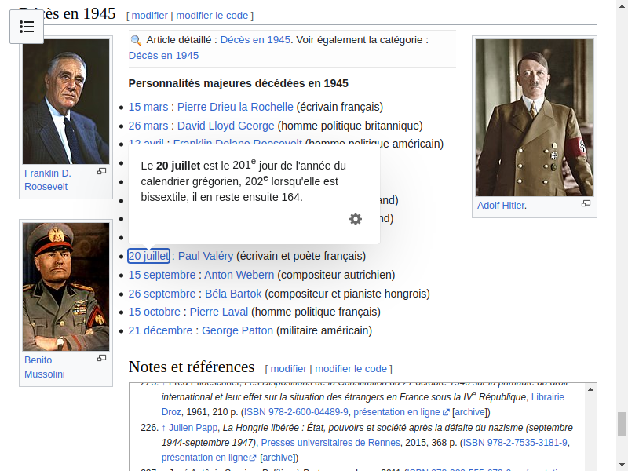

# Random Wikipedia walker

Using Selenium, create a small program that, starting from the main page https://www.wikipedia.org/, walks trough a sequence of random links and takes a snapshot of the last page.
The process is as follows:

 1. Navigate to the main page https://www.wikipedia.org/
 2. Select a random link in the page
 3. Navigate to the link
 4. Repeat steps 2 to 3 until you have visited 10 different pages
 5. Take a snapshot of the current page and save it

Include the code of the walker and the snapshot in this document.

## Answer

```java
import org.openqa.selenium.*;
import org.openqa.selenium.chrome.ChromeDriver;

import java.io.File;
import java.io.IOException;
import java.time.LocalDateTime;
import java.util.List;
import java.util.Random;
import java.util.logging.Logger;

import org.apache.commons.io.FileUtils;
import org.openqa.selenium.chrome.ChromeOptions;

public class Main {
	public static void main(String[] args) throws InterruptedException, IOException {
		Logger logger = Logger.getLogger("org.example.Main");
		// Open Chrome in headless mode
		System.setProperty("webdriver.chrome.driver", "/usr/bin/chromedriver");
		ChromeOptions options = new ChromeOptions();
		options.addArguments("--headless"); // Run Chrome in headless mode
		options.addArguments("--remote-allow-origins=*");
		WebDriver driver = new ChromeDriver(options);

		// Open a website
		driver.get("https://fr.wikipedia.org/");
		Thread.sleep(2000);

		Random random = new Random();
		List<WebElement> links;
		// Looping 10 times for 10 different pages
		for (int i = 0; i < 10; i++) {
			// Making list of valid links
			links = driver.findElements(By.xpath("//main//a[starts-with(@href, '/wiki/') and not(@disabled)]"));
			WebElement link = links.get(random.nextInt(links.size()));
			logger.info("Link " + i + ": " + link.getAttribute("href"));
			// Navigate to the link
			link.sendKeys(Keys.CONTROL, Keys.RETURN);
			Thread.sleep(5000);
			// Switch to the new tab
			driver.switchTo().window(driver.getWindowHandles().toArray()[1].toString());
		}

		// Take a screenshot
		File screenshot = ((TakesScreenshot) driver).getScreenshotAs(OutputType.FILE);
		FileUtils.copyFile(screenshot, new File(LocalDateTime.now() + ".png"));

		// Close the browser
		driver.quit();
	}
}
```

